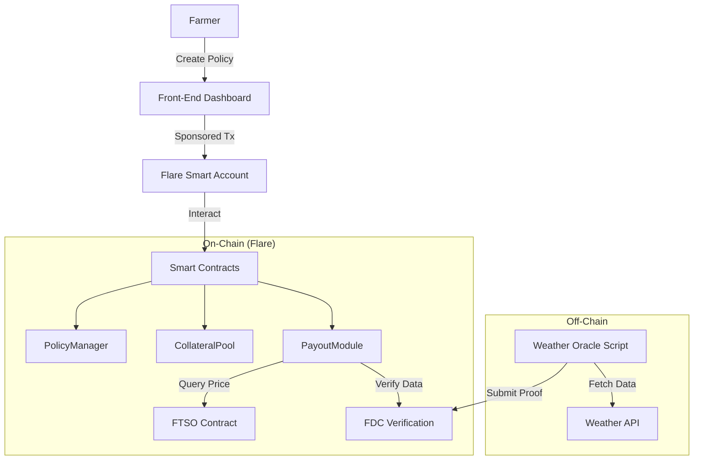

# CropGuard – Parametric Crop‑Insurance on Flare

## Introduction

**CropGuard** is a decentralized parametric insurance platform that protects smallholder farmers against adverse weather events. Built on the **Flare blockchain**, CropGuard leverages Flare’s enshrined data protocols and interoperability to create an automated, trustless crop‑insurance scheme. Farmers purchase micro‑insurance policies using stablecoins or FAsset tokens (wrapped BTC/XRP/DOGE) and receive automatic payouts when droughts, floods, or heat waves occur.

## How CropGuard Works

1.  **Policy Creation**: A farmer chooses their location, crop type, coverage period, and insured amount. The front‑end calculates a premium based on historical risk data and current commodity prices from the **Flare Time Series Oracle (FTSO)**.
2.  **Premium Payment & Collateral**: The farmer pays the premium in FLR, a stablecoin, or an FAsset (e.g., FBTC). Collateral providers stake matching FAssets, supplying liquidity and earning a share of the premiums.
3.  **Monitoring Phase**: During the policy period, a monitoring script queries off‑chain weather data via the **Flare Data Connector (FDC)**. The FDC allows smart contracts to verify events from external APIs and other blockchains.
4.  **Payout Trigger**: If weather data (rainfall, temperature, drought index) crosses predefined thresholds, the smart contract triggers an automated payout. The payout amount is pegged to current commodity prices using the FTSO price feeds.
5.  **Automatic Payouts**: The contract sends the insured amount to the farmer’s **Flare Smart Account**. Smart accounts enable account abstraction, sponsored gas fees, and social recovery, giving farmers a seamless user experience.
6.  **Settlement**: If no adverse event occurs by the policy end date, the premium is distributed as yield to collateral providers.

## Why Flare?

Flare is a data‑focused Layer 1 blockchain that embeds decentralized oracles and cross‑chain protocols. Key features included:

| Flare Technology | Role in CropGuard |
| :--- | :--- |
| **Flare Time Series Oracle (FTSO)** | Provides decentralized price feeds for commodities and stablecoins to calculate premiums and payouts in real-time. |
| **Flare Data Connector (FDC)** | Allows smart contracts to verify off‑chain weather data from meteorological APIs (e.g., rainfall and temperature). |
| **FAssets** | Trustless over‑collateralized bridge that wraps non‑smart‑contract assets (BTC, DOGE, XRP) into ERC‑20 tokens. Used for premiums and payouts. |
| **Flare Smart Accounts** | Provide account abstraction, enabling gas‑less transactions, session keys, and social recovery for a seamless user experience. |

## System Architecture



## Required Technologies

-   **Flare Testnet**: Coston or Coston2.
-   **FTSO Contract Interface**: For price feeds.
-   **FDC Service**: For verifying weather data.
-   **FAssets**: FBTC/FDOGE for payments.
-   **Development**: Hardhat, Next.js, ethers.js.

## Setup and Deployment

### 1. clone the Repository
```bash
git clone https://github.com/your-org/cropguard.git
cd cropguard
```

### 2. Install Dependencies
```bash
# Install root dependencies
npm install

# Install Contract dependencies
cd packages/contract
npm install

# Install App dependencies
cd ../app
npm install
```

### 3. Configure Environment
Create a `.env` file in `packages/contract` and `packages/app` with the following variables:

```env
FLARE_RPC_URL=https://coston2-api.flare.network/ext/C/rpc
PRIVATE_KEY=<your_private_key>
FTSO_FEED_ID=<feed_id>
WEATHER_API_URL=https://api.openweathermap.org/data/2.5/onecall
WEATHER_API_KEY=<your_weather_api_key>
FDC_ENDPOINT=<fdc_endpoint>
SMART_ACCOUNT_SPONSOR_KEY=<sponsor_private_key>
```

### 4. Deploy Smart Contracts
```bash
cd packages/contract
npx hardhat run scripts/deploy.js --network coston2
```

### 5. Run the Application
```bash
cd packages/app
npm run dev
```

## Contributing
-   **Smart Contract Engineer**: Implement `PolicyManager`, `CollateralPool`, `PayoutModule`.
-   **Off‑Chain Developer**: Build the weather oracle script.
-   **Front‑End Developer**: Develop the React dashboard.
