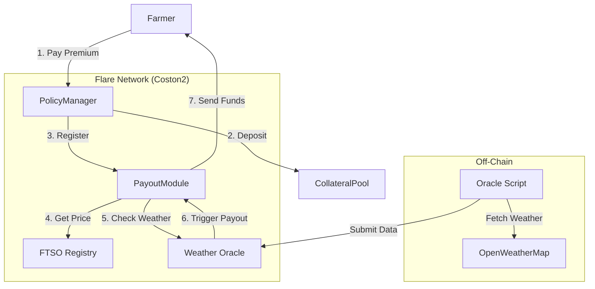

# CropGuard – Decentralized Parametric Insurance

**CropGuard** is a next-generation parametric insurance platform built on the **Flare Network**. It protects farmers against adverse weather events (droughts, floods) using automated smart contracts, real-time FTSO price feeds, and verifiable off-chain weather data.


## 🚀 Key Features

-   **Parametric Protection**: Payouts are triggered automatically based on data (e.g., "Rain < 100mm"), not claims adjusters.
-   **Real-Time Pricing**: Integrates **Flare Time Series Oracle (FTSO)** on Coston2 to fetch live `C2FLR` prices for accurate premium calculations.
-   **Verifiable Data**: Uses a custom **Weather Oracle** (simulating Flare Data Connector) to bring OpenWeatherMap data on-chain trustlessly.
-   **Instant Payouts**: policyholders are paid immediately when conditions are met.
-   **Modern Web3 UI**: A futuristic, glassmorphism-based dashboard built with **Next.js 15**, **Tailwind v4**, and **Framer Motion**.

## 🛠 Tech Stack

-   **Blockchain**: Flare Network (Coston2 Testnet)
-   **Smart Contracts**: Solidity (Hardhat)
-   **Frontend**: Next.js 15, Tailwind CSS v4, Framer Motion, Ethers.js v6
-   **Oracles**:
    -   **FTSO**: Real-time FLR/USD pricing.
    -   **FDC (Simulation)**: Custom Weather Oracle for off-chain data verification.
-   **Data Provider**: OpenWeatherMap API

## 📜 Deployed Contracts (Coston2)

| Contract | Address | Notes |
| :--- | :--- | :--- |
| **PolicyManager** | `0x24d656DEa3a449A894d3fDEB93dAc30eCCe2bADD` | Core logic for policies |
| **PayoutModule** | `0x6FA729B52166F31343753D5094251786A7604B50` | Handles FTSO pricing & payouts |
| **CollateralPool** | `0xf56233d59470984baC403E53bd28905bF43C3A35` | Holds FLR liquidity |
| **WeatherOracle** | `0xa896F4A547Fb1932Abad137907329ddf7B24b5dD` | MockFDC for weather data |
| **FTSO Registry** | `0x48Da21ce34966A64E267CeFb78012C0282D0Ac87` | Official Coston2 Registry |

## 📦 Installation & Setup

### 1. Clone & Install
```bash
git clone https://github.com/your-org/cropguard.git
cd cropguard

# Install dependencies (Root, Contract, App)
npm install
cd packages/contract && npm install
cd ../app && npm install
```

### 2. Configure Environment
Create `.env` in `packages/contract`:
```env
PRIVATE_KEY=your_private_key
WEATHER_API_KEY=your_openweathermap_key
```

### 3. Deploy Contracts (Optional)
If you want to deploy your own instance:
```bash
cd packages/contract
npx hardhat run scripts/deploy-modules.js --network coston2
```

### 4. Run the App
Start the frontend with the new neon-dark theme:
```bash
cd packages/app
npm run dev
```
Open [http://localhost:3000](http://localhost:3000).

## 🎮 Usage Guide

1.  **Connect Wallet**: Use MetaMask (switch to **Flare Coston2 Testnet**).
2.  **Create Policy**: Go to the Dashboard, select "Wheat" or "Rice", and enter insured amount.
    -   _Note: Premium is calculated live using FTSO prices._
3.  **Monitor Status**: The dashboard shows live weather conditions fetched by the oracle.
4.  **Trigger Payout**: Run the oracle script to simulate a weather event:
    ```bash
    cd packages/contract
    node scripts/oracle/weather-oracle.js
    ```
    If conditions are met (e.g., Rain > Threshold), the contract pays out instantly.

## 🏗 Architecture



## 📄 License
MIT
